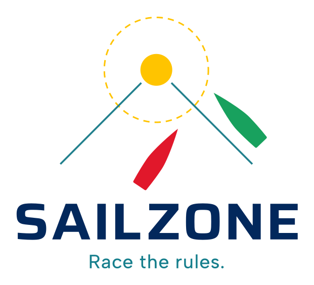

<a href="brand-kit/">brand-kit/</a>

# fields

## Roadmap

Last updated: 2026-10-09

### 1. Stabilize
- [x] Fix scenario 1 crash (out-of-bounds read in `get_field_velocity`): [#2](https://github.com/SukuWc/fields/pull/2)
- [x] AMR coupling corrections and one-cell domain shifts: [#3](https://github.com/SukuWc/fields/pull/3)
- [x] Circular disk refinement around the boat: [#4](https://github.com/SukuWc/fields/pull/4)
- [x] Constant-wind dev mode with the fluid sim off (`?devmode=1`): [#2](https://github.com/SukuWc/fields/pull/2)
- [x] WebGL canvas resizes with the window so the page no longer scrolls: [#17](https://github.com/SukuWc/fields/pull/17)
- [x] Guide and hull lines no longer vanish as the camera follows the boat: [#22](https://github.com/SukuWc/fields/pull/22)
- [x] Firefox keeps `?devmode=1` (and other URL settings) across reload: [#25](https://github.com/SukuWc/fields/pull/25)
- [ ] Robust fluid perf test: `performance.now()`, warm-up, median, opt-in ms limit, and a machine-independent cap of about 4500 ghost injections per step (the 12 ms "scenario 0 step stays cheap" check has failed since [#9](https://github.com/SukuWc/fields/pull/9))
- [ ] Faster coarse-to-fine ghost injection: decompose each coarse cell once, reuse scratch buffers, read populations by index (about 77% of the step after [#9](https://github.com/SukuWc/fields/pull/9), which took scenario 0 from about 4.5 ms to about 18 ms per step)
- [ ] Fluid steps fit the 16 ms frame budget again (about 36 ms per frame now at 2 steps per frame)
- [x] Perf overlay: cells per level and field step time: [#26](https://github.com/SukuWc/fields/pull/26)
- [ ] Run `npm test` in CI

### 2. Wind and boat feel
- [x] Fluid sim on, stable from wind 5 through 25 with the sail wake on the fine grid: [#9](https://github.com/SukuWc/fields/pull/9)
- [ ] Per-boat wind shadow / dirty air (partial: [#9](https://github.com/SukuWc/fields/pull/9) gives each boat a sail wake, so a downwind boat reads slower true wind)
- [ ] Strategy tuning

### 3. Multiplayer open water
- [ ] Shared world and shared wind
- [ ] Soft physical collisions (bump and slow)
- [ ] Server-authoritative collisions
- [ ] Reconnect

### 4. Core race loop
- [ ] Course: start line, marks, finish, boundary (partial: [#27](https://github.com/SukuWc/fields/pull/27) adds anchored mark buoy physics and scenario 11)
- [ ] Equal boats
- [ ] Race states
- [ ] Replay scrub

### 5. Rules engine
- [x] Primitives: overlap, clear ahead/astern: [#6](https://github.com/SukuWc/fields/pull/6)
- [ ] Primitives: keep-clear border, zone, mark-room
- [x] Rule registry, all-pairs evaluation, resolver: [#11](https://github.com/SukuWc/fields/pull/11)
- [x] Rule 10: [#5](https://github.com/SukuWc/fields/pull/5)
- [x] Rule 11 and Rule 12: [#6](https://github.com/SukuWc/fields/pull/6)
- [x] Rule 13: [#8](https://github.com/SukuWc/fields/pull/8)
- [ ] Rule 14 with real collisions (partial: [#12](https://github.com/SukuWc/fields/pull/12) detects contact)
- [x] Rule 15: [#10](https://github.com/SukuWc/fields/pull/10)
- [ ] Rule 16.1
- [ ] Start / OCS and individual recall
- [ ] Rule 18
- [ ] Rule 31
- [ ] Rule 28
- [ ] Penalties and exoneration (partial: [#12](https://github.com/SukuWc/fields/pull/12) assigns fault on contact; [#20](https://github.com/SukuWc/fields/pull/20) adds a pending penalty cleared by a tack and a gybe in a row, or a Q/E autopilot circle)
- [ ] Incident log (partial: [#12](https://github.com/SukuWc/fields/pull/12) stores contact incidents and a FAULT badge)
- [ ] Rule-stack labels (partial: [#12](https://github.com/SukuWc/fields/pull/12) shows the active rule and inhibited rules)

### 6. Closed beta polish
- [ ] Performance (including profiling the render side)
- [ ] Crash recovery
- [ ] Spectator mode
- [x] Hamburger settings menu on phones and touch screens: [#29](https://github.com/SukuWc/fields/pull/29)
- [ ] Accessibility
- [ ] Telemetry export

### Other
- [x] SailZone logo: [#14](https://github.com/SukuWc/fields/pull/14)
- [x] SailZone icon-only logo: [#15](https://github.com/SukuWc/fields/pull/15)
- [x] SailZone brand kit: [#18](https://github.com/SukuWc/fields/pull/18)
- [x] URL-synced settings controls: [#7](https://github.com/SukuWc/fields/pull/7)
- [x] Scenario description panel: [#12](https://github.com/SukuWc/fields/pull/12)
- [x] Overlay lines drawn above the wind-field heatmap: [#13](https://github.com/SukuWc/fields/pull/13)